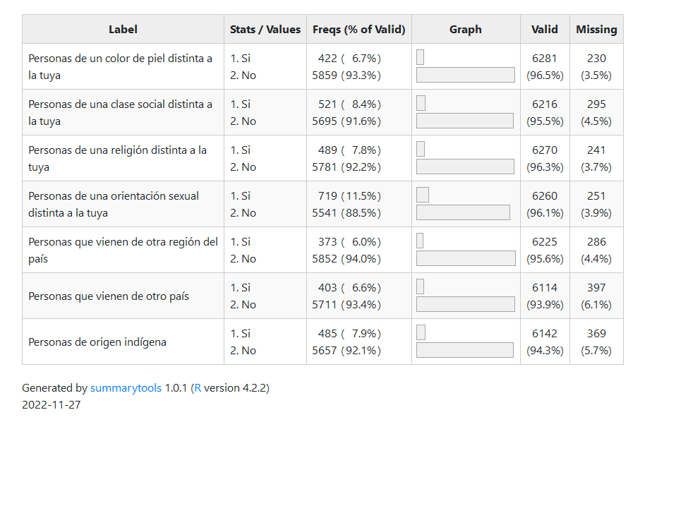
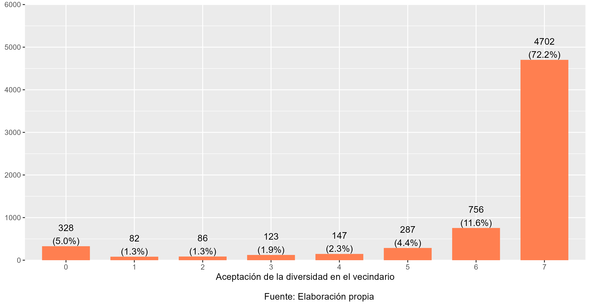
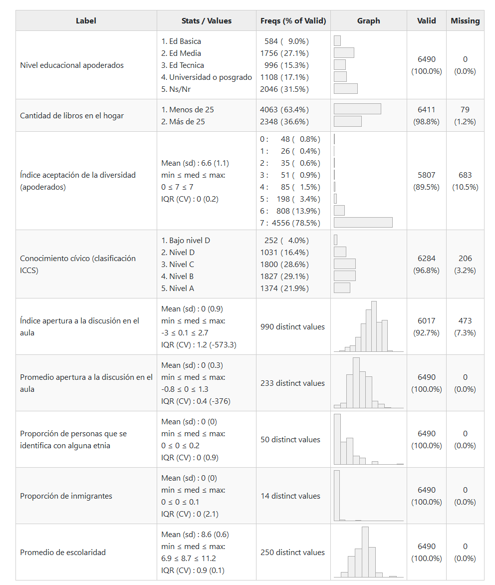
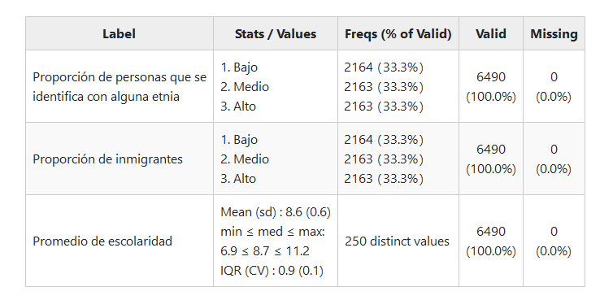

# Método

## Datos

La base de datos a utilizar corresponde al Primer Estudio de Educación Ciudadana en Chile, realizado por la Agencia de Calidad de la Educación del Ministerio de Educación. En este estudio se evaluaron estudiantes de octavo básico provenientes de 242 escuelas. La fecha de aplicación fue el 9 de noviembre de 2017.

Se utilizan tres bases de datos disponibles para este estudio. Primero, se cuenta con una base de datos de 10.213 estudiantes que poseen variables de identificación (8 variables) y el puntaje de la prueba de conocimiento cívico (1 variable). Además, se encuentra disponible una segunda base de datos que contiene las preguntas del cuestionario de Formación Ciudadana, que posee las respuestas de 8.589 estudiantes (222 variables). Al juntar ambas bases de datos el N final es de 8.589 estudiantes. Finalmente, se encuentra disponible una tercera base de datos que contiene las preguntas del cuestionario de Formación Ciudadana, con las respuestas de 6.770 apoderados (141 variables). Al juntar todas las bases de datos, el N total de respuestas completas es de 6.511 estudiantes y apoderados.

Sumado a lo anterior, para las variables del territorio se utilizará la base de datos del CENSO 2017, obtenida a partir del paquete estadístico de R *censo2017* [@vargas_censo2017_2022]. Esta base de datos contiene información respecto de datos territoriales asociados al año 2017 y se encuentra disponible para su libre uso.

## Variables

Con el fin de medir las actitudes de los y las estudiantes hacia la diversidad en sus vecindarios se utiliza la batería de preguntas del módulo “Tolerancia y Distancia Social” del cuestionario de estudiantes. Estas variables están medidas a partir de las preguntas que se presentan en la Tabla \@ref(tab:desc01). 


```{r desc01, echo=FALSE, results='asis'}
kable(data.frame(image=''),    # generar tabla
             caption="Descripción aceptación de la diversidad estudiantes",
             col.names = "",
             row.names = F,
             format = "pipe") %>%  kable_styling(latex_options = c("HOLD_position"),full_width = T)
```

Para operacionalizar esta batería de preguntas, en primer lugar, se recodificarán los ítems de modo que 0 indique que no le gustaría que cada uno de los grupos viva en su vecindario y 1 indique que sí le gustaría. Luego, se construirá un índice sumativo a partir de la suma de los ítems para representar el grado de aceptación de todos los grupos. La distribución de este índice se puede observar en el Gráfico \@ref(fig:ind-est). El valor de Alpha de Cronbach de este índice es de 0.887

```{r ind-est, echo=F, fig.cap="Indice aceptacion de la diversidad (estudiantes)"}

```

En relación con las variables independientes, estas se dividen en tres grupos: 1) variables de la familia, 2) variables de la escuela y 3) variables del territorio.

1)	Variables de la familia: 

Los recursos socioeconómicos son representados a partir de dos variables:

*	Nivel educacional (Nivel más alto entre respondente y Cónyuge/pareja): Esta variable es reportada por apoderados. Es categórica y se representa en una escala de 1 a 10, siendo 10 el nivel educacional más alto posible.

*	Cantidad de libros en el hogar: Variable categórica que identifica la cantidad de libros en el hogar según el estudiante. Las categorías de respuesta son: 1) 0 a 10 libros; 2) 11 a 25 libros; 3) 26 a 100 libros; 4) 101 a 200 libros; y 5) 200 o más libros.

Actitudes de la familia:

*	Aceptación de la diversidad de apoderados: se construye de la misma forma en que se operacionalizará la variable dependiente.

2) Variables de la escuela

* Conocimiento cívico: variable obtenida a partir de la prueba de conocimiento cívico aplicada a los y las estudiantes.

* Percepción de apertura a la discusión en la sala de clases: Esta variable refiere a la percepción de los y las estudiantes sobre los espacios e instancias disponibles en la sala de clases para discutir y opinar sobre diversos temas de interés general. Se realizó un Análisis Factorial Exploratorio que permitió estimar puntajes factoriales a partir de 5 de los 6 ítems disponibles en la base de datos (Para más detalles ver Anexo)

* Promedio de percepción de apertura a la discusión en la sala de clases: Variable construída a partir del promedio de percepción de apertura a la discusión en cada escuela. Esto permite identificar los espacios e instancias disponibles en la sala de clases para discutir y opinar sobre diversos temas de interés general a nivel de escuela.

Un resumen de estas variables se presenta en la Tabla \@ref(tab:desc02).

```{r desc02, echo=FALSE, results='asis'}
kable(data.frame(image=''),    # generar tabla
             caption="Descripción variables independientes",
             col.names = "",
             row.names = F,
             format = "pipe") %>%  kable_styling(latex_options = c("HOLD_position"),full_width = T)
```


3) Variables del territorio

* Proporción de personas que se identifica con alguna etnia: Proporción de personas de la comuna que se identifica con pueblos originarios según el Censo 2017. Variable categórica agrupada en Bajo, Medio y Alto.

* Proporción de población migrante: Proporción de inmigrantes en la comuna, a partir de datos del Censo 2017. Variable categórica agrupada en Bajo, Medio y Alto

* Promedio de escolaridad: Escolaridad promedio de la comuna, según datos del Censo 2017. Esta variable posee un rango de 6.9 a 11.2. 

Un resumen de estas variables se muestran en la Tabla \@ref(tab:desc03)

```{r desc03, echo=FALSE, results='asis'}
kable(data.frame(image=''),    # generar tabla
             caption="Descripción variables contextuales",
             col.names = "",
             row.names = F,
             format = "pipe") %>%  kable_styling(latex_options = c("HOLD_position"),full_width = T)
```

## Estrategia de análisis

La metodología planteada para realizar esta investigación es de carácter cuantitativa. Las hipótesis de esta investigación fueron pre registradas en la plataforma Open Science Framework del Centro de Ciencia Abierta (OSF, Center for Open Science), puede acceder al documento en este [enlace](https://doi.org/10.17605/OSF.IO/URPZQ). El análisis estadístico de esta investigación fue realizado mediante el software libre R versión 4.0.0.

Debido a que la muestra posee una estructura jerárquica de estudiantes anidados en comunas, se estimarán regresiones multinivel para evaluar todas las hipótesis. Reconocer que se trata de estudiantes anidados en comunas permite incluir variables medidas en diferentes niveles de análisis [@aguinis_BestPractice_2013]. Asimismo, realizar una regresión multinivel permite aislar los efectos individuales (estudiantes) de los agregados (comunas) y, a partir de esto, analizar la varianza de los resultados en cada nivel, así como la proporción de la varianza explicada por las variables independientes de cada nivel. Debido a que las características estructurales de los grupos son una dimensión clave para explicar los diferentes resultados que poseen los estudiantes [@trevino_Influence_2018] y porque tanto las comunas como las escuelas pueden diferir entre sí en cuanto a sus valores y normas comunes [@bayramozdemir_How_2020], se hace necesario estimar regresiones multinivel que permitan determinar si los resultados en las actitudes de los estudiantes dependen de sus respuestas a nivel individual o por características agregadas a nivel de comuna.

Conceptualmente, existen razones teóricas para esperar encontrar efectos de interacción entre niveles, por lo que también se evaluaran modelos de análisis de moderación, para así determinar si el tamaño o dirección del efecto de las variables independientes sobre la dependiente dependen de algún modo de una tercera variable [@hayes_introduction_2022]

De esta forma, luego de estimar la correlación intra-clase de los modelos, y siguiendo los pasos recomendados por @aguinis_BestPractice_2013, se establecen 3 tipos generales de hipótesis a evaluar:

* Hipótesis de efectos directos a nivel individual (1, 2, 3 y 4)

* Hipótesis de moderación (5)

* Hipótesis de efectos directos a nivel agregado (6, 7 y 8)
