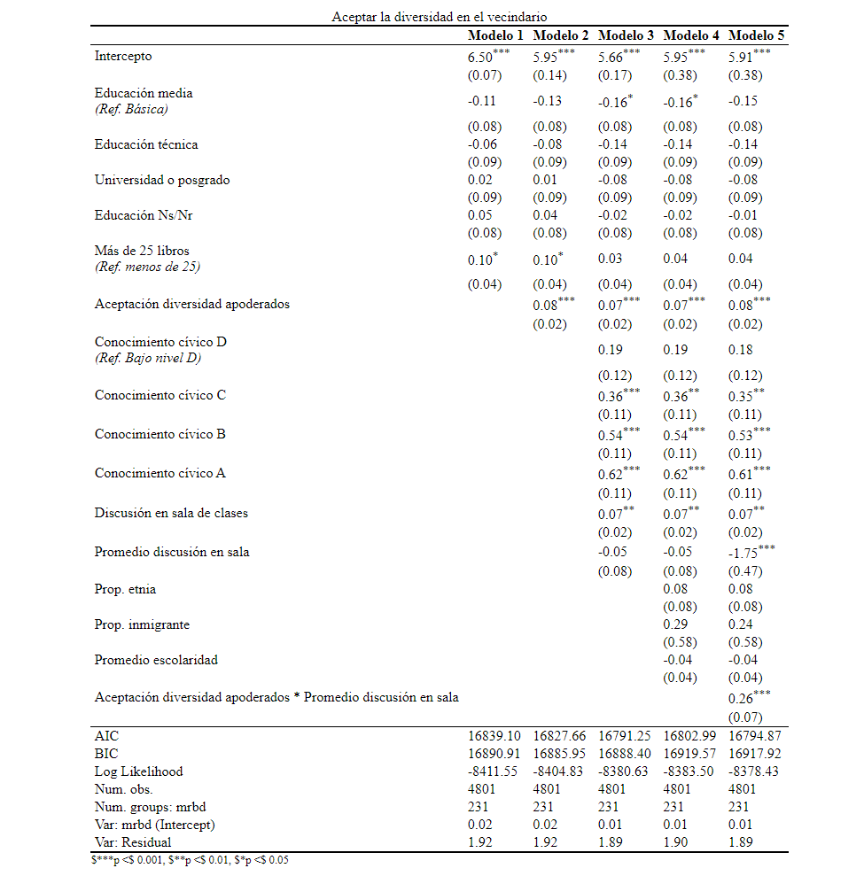

# Análisis

## Regresión multinivel

```{r reg, echo=FALSE, results='asis'}
kable(data.frame(image=''),    # generar tabla
             caption="Regresión multinivel",
             col.names = "",
             row.names = F,
             format = "pipe") %>%  kable_styling(latex_options = c("HOLD_position"),full_width = T)
```

Se estimó un modelo de regresión multinivel para predecir el índice de aceptación de la diversidad de estudiantes. El modelo incluyó las escuelas (MRBD) como efecto aleatorio. El poder explicativo del modelo es débil (R=0.03). Los resultados de esta estimación se muestran en la Tabla \@ref(tab:reg).

Las variables asociadas a el nivel educacional de los apoderados no son estadísticamente significativas, salvo para el nivel de educación media en el modelo 4 ($\beta$=-0.15, 95% CI). En cuanto a la cantidad de libros, tener más de 25 libros en el hogar tiene un efecto significativo solo en los modelos 1 y 2 (Modelo 1 $\beta$=0.09, 95% CI; Modelo 2 $\beta$=0.1, 95% CI), mientras que en los modelos 3 y 4 deja de ser estadísticamente significativa al controlar por el resto de las variables.

Las actitudes de los apoderados medidas a través del índice de aceptación de la diversidad son estadísticamente significativa al controlar por el resto de las variables y esta relación es consistente en los tres modelos que se incluye (Modelo 2 $\beta$=0.09, 99.9% CI; Modelo 3 y 4 $\beta$=0.08, 99.9% CI).

Las variables asociadas al proceso de socialización en la escuela son estadísticamente significativas en su nivel individual. Tener un nivel de conocimiento cívico medio ($\beta$=0.26, 99.9% CI) y alto ($\beta$=0.39, 99.9% CI) se asocia con una mayor aceptación de la diversidad de los estudiantes en comparación con quienes tienen un nivel de conocimiento cívico bajo, al mantener el resto de las variables constantes. El índice de apertura a la discusión en la sala de clases también se asocia positivamente con la aceptación de la diversidad de los estudiantes ($\beta$=0.13, 99.9% CI), manteniendo las demás variables constantes, pero el promedio de apertura a la discusión en la sala (nivel 2) no posee una asociación estadísticamente significativa.

Finalmente, ninguna de las variables territoriales que abordaban características contextuales de la comuna (proporción de personas que se identifican con alguna etnia, proporción de inmigrantes y promedio de escolaridad) tienen una asociación estadísticamente significativa con las actitudes de los y las estudiantes.

Estos resultados son consistentes con algunas de las hipótesis planteadas. En primer lugar, en cuanto al proceso de socialización familiar, los resultados no permiten comprobar la hipótesis 1 sobre la relación entre los recursos socioeconómicos de la familia y un mayor grado de aceptación de la diversidad en su vecindario. Por el contrario, el único resultado que posee una asociación estadísticamente significativa indica que estudiantes que poseen apoderados con un nivel de educación media aceptarían menos la diversidad en su vecindario en comparación con aquellos estudiantes que poseen apoderados con educación básica. En relación con las actitudes de los apoderados los resultados permiten corroborar la hipótesis planteada (H2), es decir, aquellos estudiantes que provienen de familiar con padres que aceptan en mayor medida que distintos grupos sociales vivan en sus vecindarios, también poseen un mayor grado de aceptación de la diversidad en sus vecindarios.

En segundo lugar, los resultados permiten comprobar las hipótesis relacionadas con el proceso de socialización escolar. Estudiantes que poseen un nivel de conocimiento cívico medio y alto poseen un mayor grado de aceptación de la diversidad en sus vecindarios en comparación con estudiantes que poseen un nivel de conocimiento cívico bajo; esto es consistente con la hipótesis 3. En relación con el índice de apertura a la discusión en las salas de clases, los resultados indican que estudiantes que perciben en mayor medida un ambiente abierto a la discusión y al debate dentro del aula poseen un mayor grado de aceptación de la diversidad, lo que permite comprobar la hipótesis 4.

En tercer lugar, los resultados obtenidos en las estimaciones de los modelos multinivel no permiten comprobar las hipótesis planteadas. Las características de las comunas en que residen los estudiantes, como la proporción de personas que se identifican con alguna etnia, la proporción de inmigrantes y el promedio de escolaridad de la comuna no afectan en el proceso de socialización de actitudes de los y las estudiantes.

## Interacciones

```{r interac, echo=FALSE, results='asis'}
kable(data.frame(image=''),    # generar tabla
             caption="Interacciones",
             col.names = "",
             row.names = F,
             format = "pipe") %>%  kable_styling(latex_options = c("HOLD_position"),full_width = T)
```

