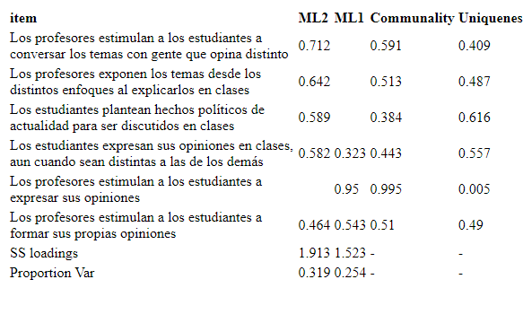
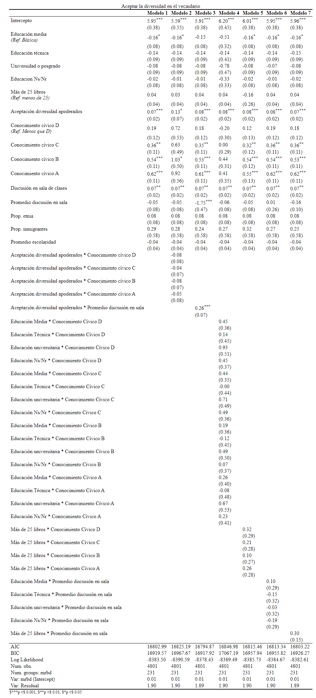

# Anexos

### Anexo 1

```{r anexo1, echo=FALSE, results='asis'}
kable(data.frame(image=''),    # generar tabla
             caption="Análisis factorial exploratorio",
             col.names = "",
             row.names = F,
             format = "pipe") %>%  kable_styling(latex_options = c("HOLD_position"),full_width = T)
```

### Anexo 2

```{r interact, echo=FALSE, results='asis'}
kable(data.frame(image=''),    # generar tabla
             caption="Interacciones entre niveles",
             col.names = "",
             row.names = F,
             format = "pipe") %>%  kable_styling(latex_options = c("HOLD_position"),full_width = T)
```