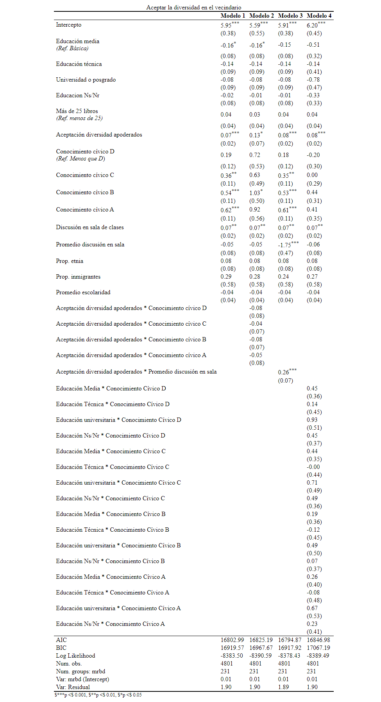

# Anexos

### Anexo 1

```{r anexo1, echo=FALSE, results='asis'}
kable(data.frame(image=''),    # generar tabla
      format=table_format,
      caption="Análisis factorial exploratorio",
      col.names = "",
      row.names = F) %>%  kable_styling(latex_options = c("scale_down","HOLD_position"),full_width = F)
```

### Anexo 2

```{r interact, echo=FALSE, results='asis'}
kable(data.frame(image=''),    # generar tabla
      format=table_format,
             caption="Interacciones entre niveles",
             col.names = "",
             row.names = F) %>%  
  kable_styling(latex_options = c("repeat_header", "HOLD_position", "scale_down"),full_width = F)
```